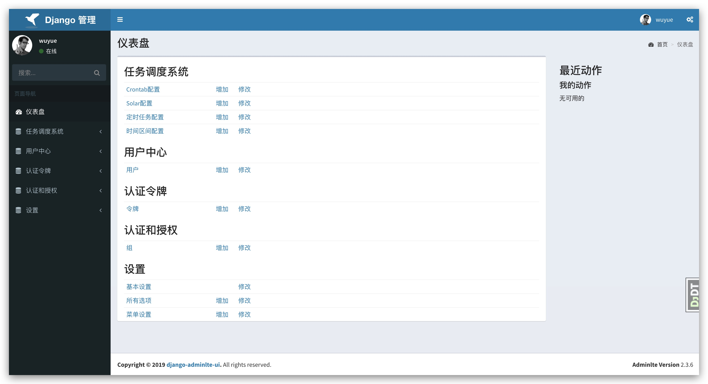

# rest_backend

## 后台api接口模板

### admin管理页



### swagger-ui页


## 基础依赖

- python3.6+

- django2.2

## 初始化

```
git clone https://github.com/wuyue92tree/rest_backend.git

cd rest_backend

pip install -r requirements.txt

python manage.py migrate

python manage.py createsuperuser

python manage.py runserver
```

## 启动

后台地址：http://127.0.0.1:8000/

API地址： http://127.0.0.1:8000/api/docs/


## docker部署上线

```
git clone https://github.com/wuyue92tree/rest_backend.git

cd rest_backend

docker build -t rest_backend .

docker run -tid -v <your-log-path>:/data/src/log -p 80:80 rest_backend
```

## 捐赠

<p align="left">
  <a href="https://github.com/wuyue92tree/rest_backend">
    
  </a>
</p>
