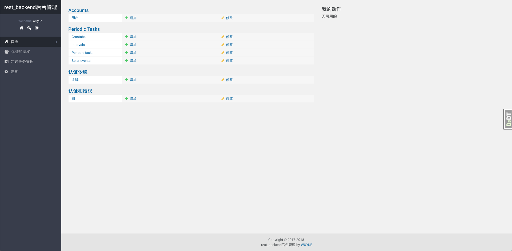
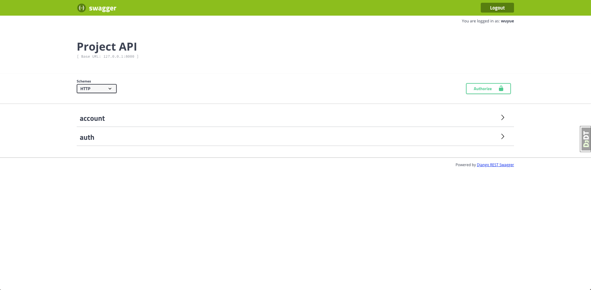

# rest_backend

## 后台api接口模板

### admin管理页



### swagger-ui页


## 基础依赖

- python3.6+

- django2.1.2

## 初始化

```
git clone https://github.com/wuyue92tree/rest_backend.git

cd rest_backend

pip install -r requirements.txt

python manage.py migrate

python manage.py createsuperuser

python manage.py runserver
```

## 启动

浏览器访问： http://127.0.0.1:8000/api/docs/


## docker部署上线

```
git clone https://github.com/wuyue92tree/rest_backend.git

cd rest_backend

docker-compose up
```


## FAQ

[说明文档](http://wuyue92tree.antio.top/opensource/rest_backend.html#FAQ)
